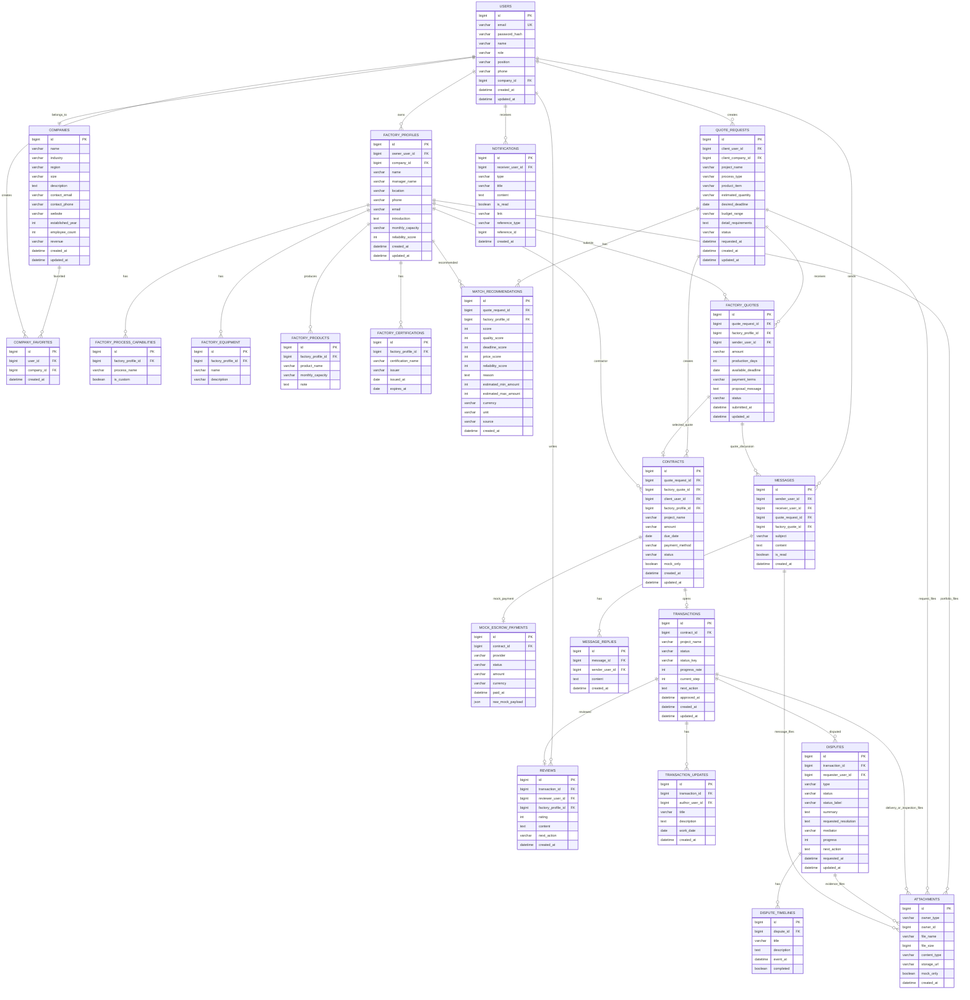

# RootMatching Backend ERD

> **출처 채택 메모 — dev-monorepo 2026-06-02**
>
> 이 문서는 `origin/feature/backend-api` (commit `4976813`)에서 가져와 dev-monorepo에 채택한 협업 자료입니다.
>
> **원작성**: 백엔드 팀 (Spring Boot + MySQL 가정)
> **dev-monorepo 적용 컨텍스트**: NestJS 11 + Prisma 6 + Neon PostgreSQL + Next.js 15 (PRD v0.4)
>
> ### 정책 정렬 차이
>
> | 원본 가정                    | dev-monorepo 정책                                                         |
> | ---------------------------- | ------------------------------------------------------------------------- |
> | Spring Data JPA + Lombok     | **Prisma 6**                                                              |
> | MySQL 8.4 (Docker)           | **Neon PostgreSQL** + `pgvector`                                          |
> | Java entity enum             | **Prisma enum** + TypeScript union                                        |
> | Hibernate `ddl-auto: update` | **Prisma Migrations**                                                     |
> | FULLTEXT index               | **`tsvector` + GIN** (Postgres)                                           |
> | `LONGTEXT`                   | `@db.Text`                                                                |
> | `OffsetDateTime`             | `DateTime @db.Timestamptz(6)`                                             |
> | `bigint` PK                  | `String @id @default(cuid())` 또는 `BigInt @id @default(autoincrement())` |
>
> ### 사용 범위
>
> - **Phase 1.W2 적용**: Prisma `schema.prisma` 작성 시 ERD 구조 60-70% 활용
> - **enum 명명**: 그대로 채택 가능 (UserRole, QuoteRequestStatus 등)
> - **인덱스/제약**: Postgres 문법으로 재해석 필요
>
> ### 우선순위
>
> 충돌 시: 본 문서 < `docs/specs/functional-spec.md` (UX) < `docs/prd/rootmatching-prd.md` (제품 정책)
>
> ### 관련 거부 결정
>
> 동일 브랜치의 Spring Boot 코드(`backend/`), Vue 코드(`frontend/`), MySQL `docker-compose.yml`은 채택하지 않습니다.
> 사유: `docs/handoffs/archive/2026-06-02-backend-api-branch-evaluation.md`

---

작성일: 2026-06-02  
대상: RootMatching 백엔드 운영 DB 전환 시 필요한 논리 ERD  
현재 구현 상태: in-memory mock API (`RootMatchingStore`) 기반이며, 아래 ERD는 추후 JPA Entity/Repository/DB migration으로 전환하기 위한 기준 설계입니다.

## 1. 설계 원칙

- `frontend/**` 목 데이터와 RootMatching 기능 명세를 기준으로 백엔드 도메인을 분리한다.
- 실제 결제, 전자서명, 파일 저장, OpenAI 호출은 직접 테이블에 강결합하지 않고 mock 상태/adapter log 수준으로 분리한다.
- 파일은 실제 바이너리를 저장하지 않고 `attachments` metadata 테이블에 저장한다.
- 견적 요청, AI 추천, 견적 제출, 계약, 거래, 리뷰, 분쟁은 각각 상태 전이를 갖는 독립 도메인으로 둔다.
- 메시지/알림은 여러 도메인 이벤트에서 생성될 수 있도록 참조 ID를 nullable로 둔다.

## 2. Mermaid ERD



## 3. 도메인별 테이블 설명

### 3.1 인증/사용자/회사

| Table               | 설명                                                                    |
| ------------------- | ----------------------------------------------------------------------- |
| `users`             | 로그인 계정. 운영 전환 시 `password_hash` 저장, mock 비밀번호 저장 금지 |
| `companies`         | 사용자 소속 회사 또는 기업 디렉토리 노출 대상                           |
| `company_favorites` | 사용자별 회사 즐겨찾기. `(user_id, company_id)` unique 필요             |

### 3.2 공장 프로필

| Table                          | 설명                                   |
| ------------------------------ | -------------------------------------- |
| `factory_profiles`             | 공장 회원의 제조 역량 프로필           |
| `factory_process_capabilities` | 금형, CNC, 용접, 표면처리 등 공정 역량 |
| `factory_equipment`            | 보유 설비                              |
| `factory_products`             | 생산 가능 품목과 월 생산 가능량        |
| `factory_certifications`       | 인증 정보                              |

### 3.3 견적 요청/AI 매칭/견적 제출

| Table                   | 설명                                    |
| ----------------------- | --------------------------------------- |
| `quote_requests`        | 발주처가 등록한 제작 의뢰               |
| `match_recommendations` | AI 또는 mock adapter가 생성한 추천 결과 |
| `factory_quotes`        | 공장이 제출한 견적                      |

`match_recommendations.source` 값 예시:

- `deterministic-mock`
- `openai-adapter`
- `manual-admin`

### 3.4 계약/결제/거래/리뷰

| Table                  | 설명                                                |
| ---------------------- | --------------------------------------------------- |
| `contracts`            | quote request와 선택 quote를 기반으로 생성되는 계약 |
| `mock_escrow_payments` | 실제 PG 연동 전 mock 에스크로 완료 이력             |
| `transactions`         | 계약 이후 작업 진행 상태                            |
| `transaction_updates`  | 공장 작업 업데이트                                  |
| `reviews`              | 거래 완료 후 발주처 리뷰                            |

### 3.5 메시지/알림

| Table             | 설명                                      |
| ----------------- | ----------------------------------------- |
| `messages`        | 문의, 견적 협의 등 1차 메시지             |
| `message_replies` | 메시지 thread 답장                        |
| `notifications`   | 메시지, 매칭, 시스템, 문의 등 사용자 알림 |

### 3.6 분쟁/증빙

| Table               | 설명                                                       |
| ------------------- | ---------------------------------------------------------- |
| `disputes`          | 품질/납기/결제/계약 분쟁 신청                              |
| `dispute_timelines` | 중재 단계별 이력                                           |
| `attachments`       | 분쟁 증빙 파일 metadata. 실제 파일 저장소는 adapter로 분리 |

## 4. 공통 attachment 설계

현재 요구사항상 실제 파일 저장은 하지 않으므로 attachment는 metadata만 저장합니다.

```text
attachments.owner_type 예시
- QUOTE_REQUEST
- FACTORY_PORTFOLIO
- MESSAGE
- TRANSACTION_DELIVERY
- TRANSACTION_INSPECTION
- DISPUTE_EVIDENCE
```

운영 전환 시에는 `storage_url`에 S3/GCS/object storage key 또는 pre-signed upload 결과 key를 저장합니다. mock 단계에서는 `storage_url = null`, `mock_only = true`를 유지합니다.

## 5. 상태 Enum 기준

### quote_requests.status

| 값           | 의미        |
| ------------ | ----------- |
| `new`        | 신규 등록   |
| `reviewing`  | 검토 중     |
| `quoted`     | 견적 제출됨 |
| `matched`    | 추천 완료   |
| `contracted` | 계약 생성됨 |
| `cancelled`  | 취소됨      |

### factory_quotes.status

| 값          | 의미        |
| ----------- | ----------- |
| `submitted` | 제출됨      |
| `accepted`  | 발주처 선택 |
| `rejected`  | 미선택/거절 |
| `withdrawn` | 공장 철회   |

### contracts.status

| 값                 | 의미                    |
| ------------------ | ----------------------- |
| `created_mock`     | mock 계약 생성          |
| `signed_mock`      | mock 전자서명 완료      |
| `escrow_paid_mock` | mock 에스크로 결제 완료 |
| `cancelled`        | 취소                    |

### transactions.status_key

| 값           | 의미         |
| ------------ | ------------ |
| `production` | 작업 진행 중 |
| `inspection` | 검수 대기    |
| `delayed`    | 지연 주의    |
| `completed`  | 거래 완료    |

### disputes.type

| 값         | 의미 |
| ---------- | ---- |
| `quality`  | 품질 |
| `deadline` | 납기 |
| `payment`  | 결제 |
| `contract` | 계약 |

### disputes.status

| 값          | 의미             |
| ----------- | ---------------- |
| `reviewing` | 자료 검토 중     |
| `proposal`  | 조정안 제시      |
| `waiting`   | 상대방 답변 대기 |
| `resolved`  | 해결 완료        |

## 6. 인덱스/제약 조건 권장

| Table                   | Constraint / Index                                                                        |
| ----------------------- | ----------------------------------------------------------------------------------------- |
| `users`                 | `unique(email)`, `index(company_id)`                                                      |
| `companies`             | `index(industry)`, `index(region)`, `index(size)`, 검색용 fulltext/name index             |
| `company_favorites`     | `unique(user_id, company_id)`                                                             |
| `factory_profiles`      | `index(owner_user_id)`, `index(company_id)`, `index(location)`                            |
| `quote_requests`        | `index(client_user_id)`, `index(status)`, `index(process_type)`, `index(created_at)`      |
| `match_recommendations` | `unique(quote_request_id, factory_profile_id, source)`, `index(score)`                    |
| `factory_quotes`        | `index(quote_request_id)`, `index(factory_profile_id)`, `index(status)`                   |
| `contracts`             | `index(quote_request_id)`, `index(factory_quote_id)`, `index(status)`                     |
| `transactions`          | `unique(contract_id)`, `index(status_key)`, `index(updated_at)`                           |
| `disputes`              | `index(transaction_id)`, `index(type)`, `index(status)`                                   |
| `messages`              | `index(sender_user_id)`, `index(receiver_user_id)`, `index(is_read)`, `index(created_at)` |
| `notifications`         | `index(receiver_user_id)`, `index(is_read)`, `index(created_at)`                          |
| `attachments`           | `index(owner_type, owner_id)`                                                             |

## 7. JPA package 전환 제안

현재 mock package 구조를 유지하되 운영 DB 전환 시 각 도메인 아래에 `entity`, `repository`, `service`, `controller`, `dto`를 둡니다.

```text
rootmatching/
├── auth/
├── user/
│   ├── entity/User.java
│   ├── repository/UserRepository.java
│   ├── dto/UserResponse.java
│   ├── service/UserService.java
│   └── controller/UserController.java
├── company/
├── factory/
├── quote/
├── matching/
├── contract/
├── transaction/
├── message/
├── notification/
├── dispute/
└── attachment/
```

## 8. 현재 mock API와 ERD 매핑

| Mock API 영역 | 현재 store key                    | 운영 전환 table                                                       |
| ------------- | --------------------------------- | --------------------------------------------------------------------- |
| 인증/사용자   | `users`, `currentUser`            | `users`                                                               |
| 회사          | `companies`, `favoriteCompanyIds` | `companies`, `company_favorites`                                      |
| 공장          | `factoryProfiles`                 | `factory_profiles`, capability/equipment/product/certification tables |
| 견적 요청     | `quoteRequests`                   | `quote_requests`, `attachments`                                       |
| AI 추천       | `recommendations`                 | `match_recommendations`                                               |
| 견적 제출     | `quotes`                          | `factory_quotes`                                                      |
| 메시지        | `messages`                        | `messages`, `message_replies`, `attachments`                          |
| 알림          | `notifications`                   | `notifications`                                                       |
| 계약          | `contracts`                       | `contracts`                                                           |
| mock 결제     | contract status only              | `mock_escrow_payments`                                                |
| 거래          | `transactions`                    | `transactions`, `transaction_updates`                                 |
| 리뷰          | transaction nested review         | `reviews`                                                             |
| 분쟁          | `disputes`                        | `disputes`, `dispute_timelines`, `attachments`                        |
